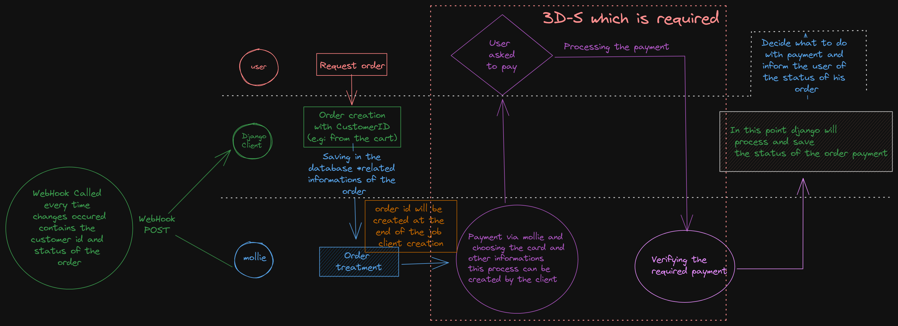

## Payment Integration Methods

This project provides examples of how to integrate different payment methods using the Mollie API.



Getting Started
To get started with this project, follow these steps:

1- Clone the repository to your local machine:

```bash
git clone https://github.com/your-username/payment-integration-methods.git
```

2- Install the project dependencies using Poetry:
cd payment-integration-methods
poetry install
3- Create a .env file in the project root directory and add your Mollie API key:

```bash
MOLLIE_API_KEY=<your-api-key>
```

4- Install ngrok by following the instructions on the official website: <https://ngrok.com/download>

5- Run the project using the following command:

```bash
flask run
```

6- Run ngrok using the following command:

```bash
ngrok http 5000
```

7- Copy the ngrok URL and paste it into .env.

8- Create a customer with the following url:
https://<ngrok-url>/create-customer

9- Create an order for the customer with the following url:
https://<ngrok-url>/create-order

This will start the Flask web server and allow you to test the payment integration methods.

Open your web browser and navigate to <http://localhost>:.

Select a payment method from the list of available methods.

Enter the required payment details, such as the amount and the customer information.

Click the "Pay" button to initiate the payment process.

Follow the instructions provided by the payment provider to complete the payment.

Once the payment is complete, you will be redirected to a confirmation page.

## Usage

This project provides examples of how to integrate payment methods using the Mollie API for now.

Contributing
If you would like to contribute to this project, please follow these guidelines:

Fork the repository and create a new branch for your changes.

Make your changes and test them thoroughly.

Submit a pull request with a clear description of your changes.

Your changes will be reviewed and merged if they meet the project standards.

## License

This project is licensed under the MIT License - see the LICENSE file for details.
